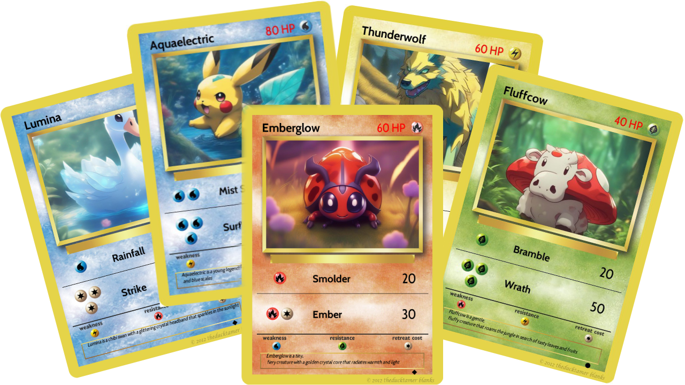

# Pokémon Card Generator

## Overview
The Pokémon Card Generator is a Java Spring Boot Application integrated with a Telegram Bot, designed to unleash the creative power of Generative AI models. This project allows you to connect your own bot, select an element, and specify the type of creature you desire. In just a few moments, you'll have your very own custom Pokemon cards!

## Objectives
 - [x] Java Spring Boot Pet Project: Demonstrate my proficiency in Java development and Spring Boot.
 - [x] REST API Communication: Utilized RESTful APIs for seamless data exchange.
 - [x] Prompt Design Practice: Practiced creating well-crafted prompts for generative AI models.
 - [x] Telegram Bots Integration: Integrated this project with Telegram to provide a user-friendly interface.
 - [x] Image Generation with AWT: Used the AWT library for quick generating eye-catching Pokemon card images.

## How to use
### Setup
This project is built with Gradle 8.2.1 and Java 17. To get started:
In application properties:
 - Set your hugging face API token.
 - Create a Telegram bot (follow the standard procedure with FatherBot).
 - Set your Telegram bot name and token.
 - Set whether you would like to use REST API calls to our models (without only partial info is generated, images of course are not being generated)
 - Run the application.

*P.s. Feel free to customize the image and description generation prompts.
This application is entirely free, as we leverage Hugging Face's free resources.
Feel free to choose your own model or other models, that are available with inference API; just remember to adjust the tokens. The current request token amount for text to text generation is 70. Refer to the Models class for a list of particularly effective image generation models.*

### Card generation
Generate your custom Pokemon cards effortlessly:
 -  Browse available commands in your Telegram bot.
 - /element shows all possible for now elements to use, select one or select random.
 - /subject [subject] lets you describe your creature. For instance, you can specify a "wolf with light blue fur and a heavy tail."
 - /generate - finally, wait a few minutes for your unique Pokemon card images to appear!

## TODOs for myself

 - To implement unit tests to ensure code reliability.
 - To integrate with Discord Bots for broader accessibility.
 - To add more elements (e.g., Fairy, Dark, Ice) for increased variety.
 - To explore image-to-image Pokemon card generation for even more creative possibilities.
 - To provide clear error acknowledgments to users to enhance the user experience.

## Inspiration

This project was inspired by Pixegami's [python project](https://youtu.be/IrDRHzT26F4) and builds upon it. While some resources from this video may require payment, I've designed this solution to be completely free by using Hugging Face and its Hosted Inference API (keep in mind that there's a daily limit for a certain number of requests, but it should suffice for your card generation needs). Special thanks to [TheDuckTamerBlanks](https://www.deviantart.com/katarawaterbender) for the blank card templates.

Feel free to reach out if you have any questions. Enjoy creating your custom Pokemon cards!
